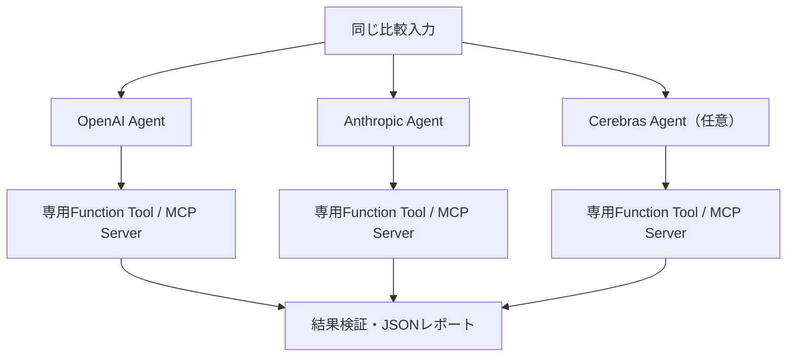

# OpenAI・Anthropic・Cerebrasの並列実行・結果比較

## 目的と構成

`agent-lab-compare-models`は同じ文字列配列を選択した2〜3モデルへ同時に渡し、
各Agentが実行した`compare_lists`の結果を比較します。最終文章の完全一致は要求しません。
選択したproviderは同じPythonプロセス内の独立したasyncioタスクで動きます。



- Agent・モデル設定・run_idをタスクごとに分離します。
- MCPモードは各Agentが専用Serverを起動・終了します。
- 各タスク内では環境変数やSDKのグローバル設定を書き換えません。
- RuntimeのAPI失敗・timeoutはproviderごとの結果に記録し、他方は最後まで実行します。
- Ctrl+Cは全タスクを中断し、終了処理を待ちます。中断時の部分JSON保存は行いません。
- Tracingは全providerで無効です。stderrのrun_idで処理を追います。

これは並列評価の最初の実装です。Agent間の役割分担・handoff・会話履歴共有は行いません。
比較以外のタスクへ拡張する際は、このタスク分離を再利用して結果検証を置き換えます。

## 準備

```bash
mise exec -- uv sync --frozen
./scripts/validate.sh
```

自分の`.env`に、選択したproviderのキーを設定してください。
OpenAIは`OPENAI_API_KEY`、Anthropicは`ANTHROPIC_API_KEY`、Cerebrasは`CEREBRAS_API_KEY`です。
このCLIは実APIを呼び、選択providerすべてのAPI利用料金が発生します。通常のCIからは実行しません。
Claude接続は[Anthropicの評価用互換API](claude.md)です。

## Function Tool経由で並列実行

```bash
(
  set -a
  source .env
  set +a
  mise exec -- uv run --frozen agent-lab-compare-models \
    --openai-model gpt-5-mini \
    --anthropic-model claude-sonnet-4-6 \
    --tool-mode function \
    --arguments '{"source":["A","B","B"],"baseline":["B","C"]}'
)
```

`--tool-mode mcp`に変更すると、GPTとClaudeがそれぞれ実stdio Serverを使用します。
モデルIDはアカウントで利用可能なものを明示してください。

## Cerebrasを含む実行

上のコマンドに`--cerebras-model qwen-3.8-27b`を追加すると3モデルで実行します。
`.env`には`CEREBRAS_API_KEY`も必要です。既存`.env`には自動追加されません。
個別モデル引数を2つだけ指定すれば、OpenAI＋CerebrasやAnthropic＋Cerebrasも実行できます。
モデル引数は少なくとも2つ必要です。1つだけなら単独の`agent-lab`を使用してください。
準備・互換制約・実API検証は[Cerebras手順](cerebras.md)にまとめています。

## 設定の扱い

単一provider用CLIの`AGENT_PROVIDER` / `AGENT_MODEL` / `AGENT_TRACING_ENABLED`やTOMLは読みません。
providerとモデルが並列実行中に混ざらないよう、モデル名は個別のCLI引数で必須指定します。
その他の設定もこのCLIの引数と既定値だけで決まります。キーは対応する環境変数から読みます。
OpenAIクライアントのSDK環境設定（base URL等）は従来のOpenAI経路に従います。

| 引数 | 既定値・意味 |
|---|---|
| --arguments | 必須。source / baselineのJSON。比較Toolと同じ入力制約 |
| --openai-model | OpenAI側モデルID。選択時のみ指定 |
| --anthropic-model | Claude側モデルID。選択時のみ指定 |
| --cerebras-model | Cerebras側モデルID。選択時のみ指定 |
| --tool-mode | function。mcpも指定可能。各Agentに共通 |
| --max-turns | 3。各Agentの最大ターン数 |
| --run-timeout | 60秒。各Agentの実行timeout |
| --connect-timeout / --call-timeout | 各10秒。MCP用 |
| --log-level | INFO。WARNING / ERRORも指定可能 |

同じ固定指示とJSONを全モデルへ渡します。任意の自然文promptの指定は今回の対象外です。
全体所要時間は遅い側の実行と終了処理に依存し、各タスクの時間の合計とは異なります。
処理時間にはネットワークやMCP起動も含まれます。1回の結果だけでモデル性能の優劣は判定できません。

## 結果JSON

stdoutへ1つのJSONを出力します。ログはstderrです。

| フィールド | 内容 |
|---|---|
| batch_run_id | 比較実行全体のID |
| status | すべてのTool契約検証に成功ならsuccess、それ以外はfailed |
| duration_ms | 全タスクの終了までの全体時間 |
| results_match | すべての比較JSONが取得できれば一致判定。取得不能ならnull |
| runs | openai、anthropic、cerebrasの順（未選択は除外）に各実行結果 |
| runs[].provider / model / run_id | 対象provider・モデル・独立した実行ID |
| runs[].status / duration_ms | 各実行の結果・所要時間 |
| runs[].final_output | モデルの最終応答。未取得ならnull |
| runs[].comparison | Toolの比較JSON。未取得・不正な形式ならnull |
| runs[].error | エラー分類・例外型のみ。成功時はnull |

合格条件は、各Agentがcompare_listsをちょうど1回呼び、引数が要求と一致し、
呼出しIDで対応した結果がドメイン関数の期待値と一致し、最終応答があることです。
Tool未使用・入力の勝手な変更・Toolエラー・結果不一致を成功扱いにしません。
`results_match=true`だけでは成功を意味しません。全モデルが同じ不正結果を返す場合もあるため、
必ず`status=success`を確認してください。

| 終了コード | 意味 |
|---|---|
| 0 | 選択providerすべてがTool契約検証に成功 |
| 1 | 1つ以上のAPI実行・Tool契約検証が失敗。JSONに成功分も保持 |
| 2 | CLI・入力・設定・APIキー不備。API呼出し前に停止 |
| 130 | Ctrl+Cで中断 |

APIキー不足は開始前に選択providerすべてを確認します。後から起こる認証・利用枠・通信エラーは片側の実行失敗です。
API失敗の例外本文やキーをログ・errorフィールドへ出しません。
レポートには比較結果とモデル応答が含まれるため、保存する場合はデータの扱いに注意してください。

## レポートを保存する場合

```bash
mkdir -p reports
(
  set -a
  source .env
  set +a
  mise exec -- uv run --frozen agent-lab-compare-models \
    --openai-model gpt-5-mini --anthropic-model claude-sonnet-4-6 \
    --tool-mode mcp \
    --arguments '{"source":["A","B","B"],"baseline":["B","C"]}' \
    > reports/mixed-models-mcp.json
)
```

同名ファイルは上書きされます。履歴を残す場合はファイル名を変えてください。
`reports/`はGit管理対象外です。このJSONはCIのJUnit Artifactには含まれません。

## API不要の検証

```bash
mise exec -- uv run --frozen pytest \
  tests/unit/test_model_comparison.py tests/integration/test_mixed_models.py -v
```

並列性・実行ID分離・同じ入力の受渡し・片側失敗・timeout・キャンセル・Tool契約違反・
CLIのゲートと終了コードを検証します。統合テストは各providerを別のScriptedModelに置き換え、
実Runner、Function Tool、MCP子プロセス2〜3つの正常終了を確認します。
実APIでの並列動作は上のCLIをUbuntuで明示実行して確認します。
