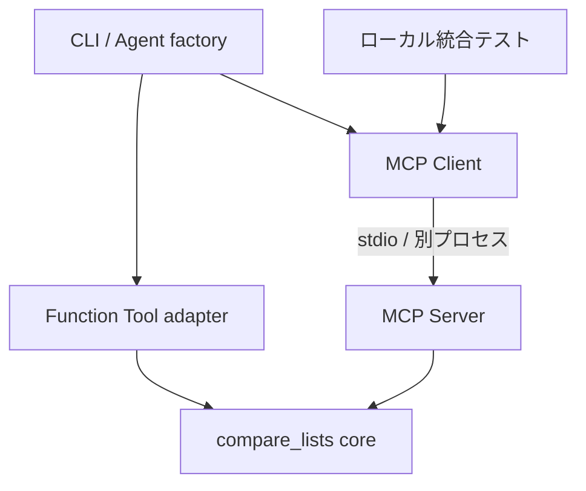

# Next Steps 3–6: Function Tool / MCP / Integration Tests

- 状態: Step 3〜6実装済み。実APIテスト自体の実行は利用者の明示指定時のみ
- 作成日: 2026-09-27
- 調査基準: main / 96a4180de84f6531985d3a460c1a9a2bd2791c41
- 対象: Ubuntu 24.04、mise + uv、OpenAI Agents SDK
- 成果: 同じ処理を Function Tool とローカル MCP の両方から呼び出し、課金なしで継続検証する。

## 実装状況（Step 3）

compare_listsのドメイン関数、明示JSON SchemaのFunctionTool、Agent factory、CLI、
API不要の境界テストとScriptedModelによるRunnerテストを追加しました。
[契約](tool-contract.md)と[運用手順](runbook.md)が実装済み機能の仕様です。
デコレータによる自動schema生成案は、不明キー拒否と厳密なJSON検証のため、
FunctionToolの直接生成へ具体化しました。
Step 4のMCP Server・実stdioテストを追加済みです。[MCP Server仕様](mcp-server.md)を参照してください。
Step 5のTOML設定・診断Client・Agent側MCP接続も実装済みです。[MCP Client仕様](mcp-client.md)を参照してください。
Step 6の経路一致・異常系・liveゲートも実装済みです。[テスト運用手順](testing.md)を参照してください。
以下の現状表と計画は設計作成時点の記録です。

## 1. 現状と変更範囲

README、AGENTS.md、CLAUDE.md、mise.toml、pyproject.toml、uv.lock、
src/agent_lab、tests、scripts/validate.sh、既存CIを確認した。

| 項目 | 現状 | 今回の設計 |
|---|---|---|
| Agent | main.py から Runner.run でモデルを呼ぶ | Agent生成と実行を分離、Tool経路を選択 |
| Function Tool | 未実装 | 副作用のないリスト比較 |
| MCP Server / Client | 未実装 | Python、stdio、単一ローカルServer |
| pytest | Agent生成のsmoke testのみ | unit / integration / live の3区分 |
| setup / validate | スクリプトあり | 既存入口を再利用 |
| GitHub Actions | validate.yml あり | 将来、通常検証にローカル統合テストを含める |
| bootstrap | スクリプトあり | 名前変更との整合性を実装時に確認 |
| CLI | agent-lab は __init__.py の挨拶を実行 | main.py の同期CLI関数に入口を統一する計画 |

ランタイムは mise.toml を正とする。調査時の uv.lock は
openai-agents 0.22.2 / mcp 2.2.0 を固定していた。
これはリポジトリの記録であり、この設計作業でその環境を再現・実行したという意味ではない。

今回は設計文書とREADMEの更新。以下に示すファイル・CLI・設定は実装予定であり、
この文書の追加だけでは実行できない。実装時には固定SDKのAPIと互換性を検証する。

## 2. 設計判断

1. 最初のToolは compare_lists。ユーザーのCSV一覧比較に展開できる、入出力の明確な題材とする。
2. 比較ロジックは通常のPython関数に置く。SDKのデコレータやMCPを依存させない。
3. Function Tool と MCP Tool は薄いアダプタとし、同じ関数を利用する。
4. 初回MCP ServerはPython。既存architecture.mdのNode.js案を初回実装について具体化する。
   Node.jsは将来の独立Server向け候補として残す。
5. 通信はstdio。HTTP公開、認証基盤、DB更新、任意ファイル操作は別段階で設計する。
6. MCPの結合検証は外部APIなしで行う。実LLMテストだけを明示実行にする。

Python案はロジック共有とuvによる依存管理が容易。
TypeScript案は言語間連携の学習に向くが、pnpm依存・ビルド・契約の二重管理が増える。
まずPythonで契約を確立し、必要になった時点で同じ契約のTypeScript Serverを追加する。

## 3. 構成



Function経路とMCP経路は比較用に別々に選択する。
初期Agentには同名・同用途のToolを両方登録しない。
MCPはToolを公開・呼び出す仕組みであり、Server自身にLLMは不要。

### 予定ファイル

| ファイル | 責務 |
|---|---|
| src/agent_lab/domain/list_comparison.py | 入力検証、集合比較、結果型 |
| src/agent_lab/tools/list_tools.py | Agents SDK用Function Tool |
| src/agent_lab/mcp/server.py | MCP Tool登録、stdio起動 |
| src/agent_lab/mcp/client.py | SDKクライアント接続、一覧・呼出し |
| src/agent_lab/agent_factory.py | modeに応じてAgentを生成 |
| src/agent_lab/config.py | TOML / 環境変数 / CLIの解決・検証 |
| src/agent_lab/main.py | argparse、async処理、同期cli入口 |
| config/agent.toml | 非秘密の設定例 |
| tests/unit/ | ドメイン・アダプタ・設定検証 |
| tests/integration/ | 実stdio Serverとの結合検証 |
| tests/live/ | 明示実行する実LLM検証 |
| tests/conftest.py | live実行ゲート、共通fixture |
| docs/tool-contract.md | 実装時に確定するJSON契約 |
| docs/runbook.md | 実装時に追加する運用・復旧手順 |

必要なパッケージディレクトリには __init__.py を追加する。
既存tests/test_smoke.pyは維持し、段階的に整理する。

## 4. Step 3 — Function Tool

### 契約

Tool名: compare_lists

入力:

```json
{"source":["A","B","B"],"baseline":["B","C"]}
```

出力:

```json
{"same":["B"],"source_only":["A"],"baseline_only":["C"]}
```

| 条件 | 仕様 |
|---|---|
| source / baseline | 必須、文字列配列、空配列可 |
| 重複 | 集合として1件にまとめる |
| ソート | Python文字列の標準順序、ロケール非依存 |
| 大文字・小文字 | 区別する |
| 前後空白 | 保持する。暗黙のstripはしない |
| Unicode | 正規化しない。入力文字列を保持 |
| 空文字 | 無効。入力エラー |
| 数値 / null / bool | 文字列へ自動変換せず拒否 |
| 上限案 | 各配列1,000要素、各文字列256文字 |
| 不明な入力キー | 拒否 |
| ファイル入出力 | なし。CSV読込みは将来別アダプタで扱う |

要素数上限は重複除去前に適用する。
これは学習用の上限であり、LLMに大量データを渡す運用には別途出力件数・トークン予算が必要。

通常の比較関数を先に完成させ、Agents SDKのFunction Toolへラップする。
型注釈・説明文から生成されるスキーマもテストする。
文字列への暗黙変換がSDKで発生しないことを確認する。

ドメイン層は入力不正を専用例外で通知する。
アダプタは秘密情報を含まない短いエラーに変換し、成功結果に空配列を返してごまかさない。
スタックトレース・入力全文はモデルへ返さない。

### 完了条件

- APIキーなしで比較関数とFunction Toolの直接呼出しをテストできる。
- 正常・空・重複・日本語・不正型・上限超過の期待値が一致する。
- AgentのToolsにcompare_listsが1つ登録される。
- 課金なしのfake modelで「Tool要求→実行結果→最終応答」を確認する。
- 実LLMによるTool選択はStep 6のliveテストに分離する。

## 5. Step 4 — MCP Server

公式Python MCP SDKを用いてcompare_listsを公開する。
利用するServer APIはmcp 2.2.0の実体を確認して決める。
旧バージョン向けFastMCPサンプルや別配布のfastmcpパッケージを無確認で混在させない。

- Clientが子プロセスとして起動する。
- stdin/stdoutはMCP通信専用。起動バナーやprintログを混ぜない。
- loggingはstderrへ出力する。
- Tool名・入力制約・比較結果はFunction経路と共通。
- SDKが対応する構造化結果を利用し、Client側で共通結果型へ検証・変換する。
- Tool処理エラーと、未知Tool・通信・プロトコルエラーを区別する。
- Tool処理エラーはisError等、固定SDKと合意プロトコルの規定に従う。
- stdioの初期化・プロトコル互換性はSDKに任せ、JSON-RPCを手作業で実装しない。

直接mcpをimportするため、pyproject.tomlの直接依存としてmcpを追加する。
既存の推移的依存だけに頼らない。
バージョン範囲は互換性確認後に宣言し、uv.lockを同じ変更で再生成する。
開発時のlock更新とCIのuv sync --frozenを区別する。

### 完了条件

- 実Clientから接続、Tool一覧取得、compare_lists呼出しが成功する。
- Function経路とMCP経路の正規化後の結果が一致する。
- ログ出力を有効化しても通信が壊れない。
- 接続終了後にServerプロセスが残らない。

## 6. Step 5 — MCP Client

2つの利用方法を分ける。

1. 診断用: MCP SDK ClientでTool一覧と直接呼出し。LLM・APIキーは不要。
2. Agent用: Agents SDKのstdio MCPアダプタを利用し、AgentのToolとして接続する。

Agent用アダプタの候補はMCPServerStdio。採用時は固定SDKの公開API、
起動引数、timeout、環境変数継承、終了処理を確認する。
初期化、Tool一覧取得、呼出しをSDKが行う順序で使用する。

### プロセス管理

- 起動コマンドはsys.executableと固定のmodule名を使用する。
- shell=True、LLMが生成したコマンド、ユーザー入力の実行ファイル名は使わない。
- 作業ディレクトリを明示する。パスに空白があるケースも検証する。
- 子プロセス環境は許可リスト方式。APIキーを転送しない。
- SDKの暗黙継承も確認し、許可リスト外のテスト用環境変数が子にないことをテストする。
- async context manager内でAgent実行まで完了させる。
- 正常終了、例外、timeout、キャンセルで後始末する。
- 接続・呼出し・全体実行にそれぞれ上限時間を設ける。
- 初期設計では自動再試行しない。無限再試行や二重実行を避ける。

stdioはプロセス分離であり、OSのアクセス権を制限するsandboxではない。
将来ファイル・DB Toolを加える際は、その時点で権限とアクセス範囲を設計する。

## 7. 設定・CLI・ログ

設定の優先順位: CLI > 環境変数 > TOML > デフォルト。
秘密情報は環境変数のみ。model名は実装時に利用可能な値を設定する。
設定ファイル欠落を明示指定した場合と、不正値の場合は終了コード2で失敗する。

設定例（予定）:

```toml
[agent]
tool_mode = "function"
max_turns = 5
run_timeout_seconds = 60

[mcp]
connect_timeout_seconds = 10
call_timeout_seconds = 10

[logging]
level = "INFO"
```

環境変数候補: OPENAI_API_KEY、AGENT_MODEL、AGENT_TOOL_MODE、AGENT_LOG_LEVEL。
.env.exampleの秘密値は空欄を維持する。.envは自動読込みの有無を実装時にREADMEへ明記する。

予定CLI:

```bash
# 以下は実装後に利用できる計画上のコマンド
uv run python -m agent_lab.main --tool-mode function --prompt 'A,B と B,C を比較'
uv run python -m agent_lab.main --tool-mode mcp --prompt 'A,B と B,C を比較'
uv run python -m agent_lab.mcp.client list-tools
uv run python -m agent_lab.mcp.client call compare_lists --arguments '{"source":["A","B"],"baseline":["B","C"]}'
```

最初の2つは実モデルを呼ぶためAPI料金が発生し得る。
後半2つはローカル処理のみ。
Server単体のstdio起動は入力待ちになるため、疎通確認にはClientコマンドを使う。

pyproject.tomlのagent-labエントリポイントをagent_lab.main:cliへ変更し、
cli()がasyncio.run(main(...))を実行する。
python -mとconsole scriptで同じ処理へ到達させる。
引数なし実行は既存の接続確認を維持し、比較は明示指定で行う。
Agentをmodule import時に作らず、factoryで生成する。

| 終了コード | 意味 |
|---|---|
| 0 | 成功 |
| 1 | Tool / 接続 / API / 実行失敗 |
| 2 | CLI / 設定不正 |
| 130 | ユーザー中断 |

ログ形式: [YYYY-MM-DDTHH:MM:SS] [LEVEL] message。
INFO: 接続・完了・所要時間、WARN: 上限拒否等、ERROR: 失敗分類。
APIキー、環境変数一覧、入力配列全文はログに出さない。
初期段階はstderrログまでとし、ログファイルのローテーションはNext Step 9で追加する。
通常テストはSDK tracingを無効化し、意図しない外部送信を避ける。

## 8. Step 6 — Integration Tests

「Integration Test = 外部APIあり」にはしない。
本設計では実プロセス・実stdio通信も統合テストに含める。

| 区分 | 対象 | 外部通信 / 課金 | 標準実行 |
|---|---|---|---|
| unit | 比較、検証、設定、Functionアダプタ | なし | 実行 |
| integration | 実MCP Server、SDK Client、fake modelとの連携 | なし | 実行 |
| live | 実LLMによるTool Calling | あり得る | skip |

pytestにintegration / live markerと--run-liveオプションを実装する。
marker登録だけではskipされないため、conftest.pyでliveを明示的にskipする。
--run-liveで実行を要求したのにキーまたはモデル設定がない場合は設定エラーにする。
標準テストではキーを与えず、モデル通信とtracingを無効化する。
fake modelは実Tool呼出しを要求し、その戻り値を受け取って終了する決定的実装にする。

### テスト仕様

| ケース | 期待結果 |
|---|---|
| 正常 / 空 / 重複 / 日本語 | 契約どおりの結果 |
| 不正型 / 空文字 / 上限超過 | 明確な入力エラー |
| FunctionとMCPの同一入力 | 正規化した結果が一致 |
| 実Serverの起動・Tool一覧 | compare_listsの名前・schema一致 |
| Tool呼出し失敗 | 成功扱いせず診断可能 |
| 未知Tool | プロトコル側の失敗として扱う |
| Server異常終了 | 有限時間で失敗、ハングしない |
| 応答しないテストServer | timeout、終了処理を確認 |
| 呼出し中のキャンセル | Client・子プロセスが終了する |
| 標準出力 / 標準エラー | stderrログがstdio通信を破壊しない |
| 子プロセス環境 | 許可外のダミー秘密変数を継承しない |
| fake model + Function / MCP | Tool実行と結果受渡しまで確認 |
| live未指定 | API呼出し前にskip |
| live明示 + 設定不足 | 設定エラー |
| live正常 | Toolが実際に呼ばれ、結果契約が一致 |

ライブテストで最終文章の完全一致を期待しない。
数値・配列の正確性とTool呼出しの証拠を確認する。
接続・API拒否・timeoutは黙ってskipせず失敗として報告する。

### 予定検証コマンド

```bash
uv sync --frozen
uv run ruff check .
uv run ruff format --check .
uv run pytest -v
uv run pytest -m integration -v
uv run pytest -m live --run-live -v
./scripts/validate.sh
```

--run-liveはStep 6で実装済み。OPENAI_API_KEYとAGENT_MODELの両方が必要です。
既存validate.shはpytest -vを呼ぶため、通常実行にローカル統合テストを組み込める。
既存GitHub Actionsはそのvalidate.shを呼ぶため再利用できる。
実API用secretを通常CIに追加しない。live用workflowは後続の別変更とする。

## 9. 実装順序と受入条件

| 順序 | 変更 | 合格条件 |
|---|---|---|
| 3 | 共通比較関数、Function Tool、factory、CLI整理 | unitとfake modelによるFunction呼出し成功 |
| 4 | Python MCP Server、直接依存とlock更新 | 実stdioで一覧・呼出し・終了成功 |
| 5 | 診断Client、Agent用MCP接続、設定 | 両経路同値、timeout、環境分離、終了処理 |
| 6 | 全経路統合テスト、liveゲート、手順書 | 通常API通信ゼロ、live明示時だけ実通信 |

テストは各段階で追加する。Step 6まで検証を先送りしない。
各実装変更でREADME・architecture・CLIの実態を同期する。

リリース前チェック:

- [ ] mise指定環境でuv sync --frozenが成功
- [ ] 直接mcp依存とlockが整合
- [ ] schemaと実際の入力検証が一致
- [ ] 通常テストがAPIキーなしで成功
- [ ] 子プロセスが残らない
- [ ] timeout / キャンセル / 異常終了を検証
- [ ] ruff / compile / git diff --check / validate成功
- [ ] setupからの再構築手順が実際に動作
- [ ] bootstrap後もmodule・CLI名が整合
- [ ] 成功・失敗・skip件数と実行時間を記録

初期の性能目標はローカル統合テスト全体30秒以内（依存取得を除く）。
安定性目標は同じ環境で10回連続成功、子プロセス残存0。
これらは受入目標であり、今回の測定結果ではない。
カバレッジ数値より境界条件・通信失敗の検証を優先し、導入時に測定方法を決める。

## 10. 運用・障害時対応

| 症状 | 確認と対応 |
|---|---|
| moduleが見つからない | uv sync --frozen、使用Python、起動cwdを確認 |
| MCP初期化失敗 | Serverのstderr、SDK互換性、stdoutへのログ混入を確認 |
| timeout | Server生存・処理上限・終了処理を確認。無条件に時間を延ばさない |
| 認証失敗 | Agent側のキー設定を確認。値をログへ出さない |
| 比較結果が違う | 重複・空白・大小文字・Unicodeの契約を確認 |
| CIでliveが走る | conftestのskipゲートとmarker付与漏れを確認 |

変更は段階ごとのブランチ/PRで行い、問題時は対象変更をrevertする。
元に戻す際はpyproject.tomlとuv.lockをセットで戻す。
本番データの読書きがない初期段階ではデータ移行は不要。

## 11. これだけ覚えればOK

- Function ToolはAgentの中から呼ぶPython機能。
- MCP Serverはその機能を別プロセスで公開する窓口。
- MCP Clientはその窓口に接続して呼び出す側。
- Integration Testsで接続から終了まで自動確認する。
- 最初は同じリスト比較を両方から呼び、差がないことを確かめる。
- 通常検証は課金なし。実LLM検証だけ明示実行する。

## 12. 根拠・検証限界

リポジトリの実ファイルを基準に設計した。
SDK APIのシグネチャ、Python 3.14環境の依存解決、実通信、性能は実装時の検証事項。
この文書変更では機能テスト・実APIテストを実行していない。

参考:
- [調査時README](https://github.com/koura718/agent-lab/blob/96a4180de84f6531985d3a460c1a9a2bd2791c41/README.md)
- [調査時依存定義](https://github.com/koura718/agent-lab/blob/96a4180de84f6531985d3a460c1a9a2bd2791c41/pyproject.toml)
- [調査時lock](https://github.com/koura718/agent-lab/blob/96a4180de84f6531985d3a460c1a9a2bd2791c41/uv.lock)
- [MCP stdio transport](https://github.com/modelcontextprotocol/modelcontextprotocol/blob/main/docs/specification/2026-07-28/basic/transports/stdio.mdx)
- [MCP Python SDK logging](https://py.sdk.modelcontextprotocol.io/handlers/logging/)

最新プロトコル文書を固定SDKの対応保証とは扱わない。
実装時はClient/Serverが合意するプロトコルに合わせて統合テストで検証する。
